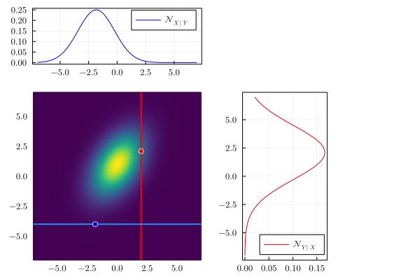
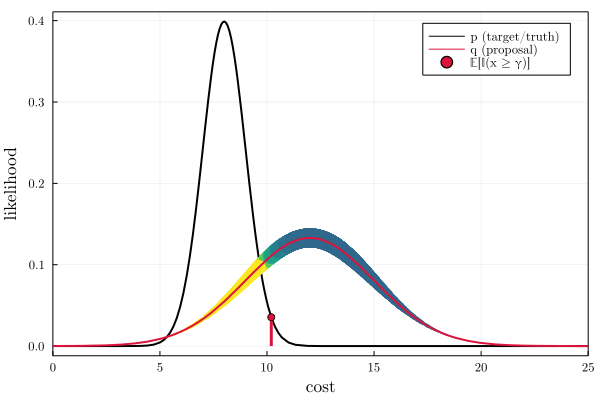
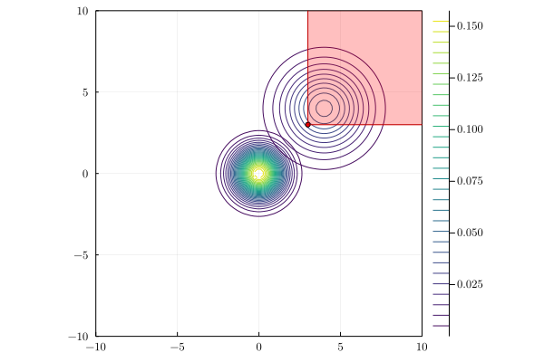
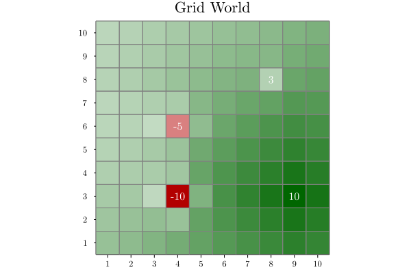
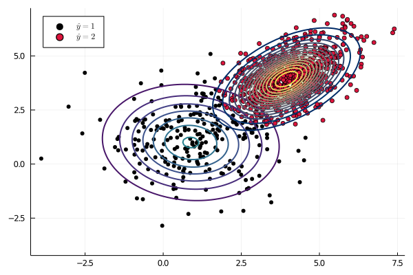
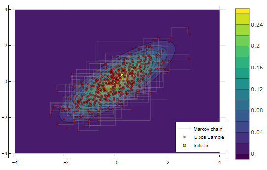

# PlutoNotebooks
Random Pluto notebooks in Julia.

## Honerable Mentions / WIPs

## Gaussian processes

  

## Importance sampling

Univariate | Multivariate
:---------------:|:----:
 | 

## Value iteration

  

## The EM algorithm

  

## Gibbs sampling

  

## Beta distribution and Thompson sampling

  

## Dirichlet distribution

  

## Nearest neighbor

  

## K-means clustering

  

## Deep learning

Multi-layer neural network with regularization, from scratch.

  

## Autoencoder

Autoencoder applied to MNIST using `Flux.jl`.

  

## Neural network classifier

Multi-layer perceptron classifier for MNIST using `Flux.jl`.

    

    

    

    

## Markov decision processes

⟨𝒮, 𝒜, 𝑅, 𝑇, γ⟩
