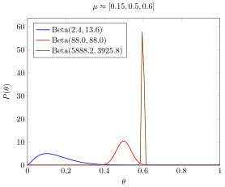
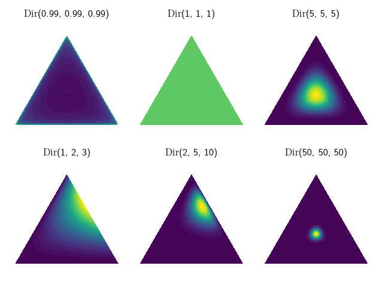
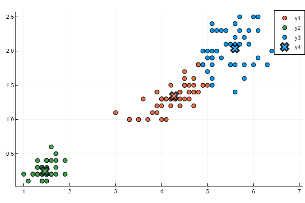
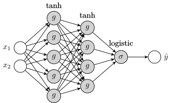
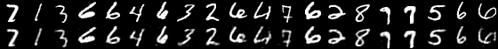

# PlutoNotebooks
Random Pluto notebooks in Julia.

## Beta distribution and Thompson sampling

  

## Dirichlet distribution

  

## Nearest neighbor

  

## K-means Clustering

  

## Deep learning

Multi-layer neural network with regularization, from scratch.

  

## Autoencoder

Autoencoder using MNIST with `Flux.jl`.

  

## Neural network classifier

MNIST multi-layer perceptron classifier using `Flux.jl`.

    

    

    

    

## Markov decision processes
*(work in progress)*

⟨𝒮, 𝒜, 𝑅, 𝑇, γ⟩
